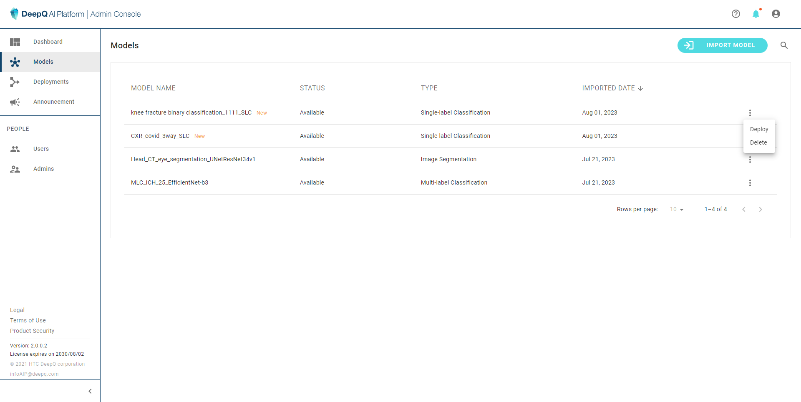

# 3. Models

Here the admin can view the list of all deployable models on the Deeploy system. Every model showing in the list is deployable.

Each row contains the folloing information：

* Model name：The name of the training task given in AI Training module
* Status：the status of each model whether it is available for deployment
* Type：Classification, Detection or Segmentation
* Imported date：The date when the model is imported as a deployable model

Users can look for any specific model by going through the list or search by keywords. You can also delete a model to free up some space.

Clicking on the "**IMPORT MODEL**" will allow you to import DeepQ AI models that are trained elsewhere.

