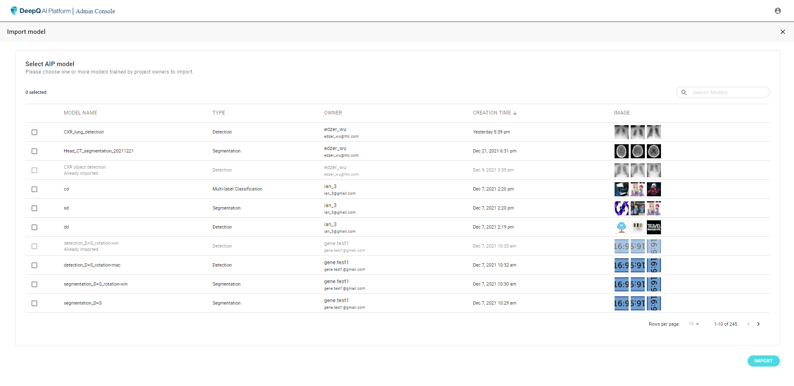

# 3.1 Import models

The list here shows all the models trained in the AI Training module. Any "finished" or "stopped" training task will result in a model that can be imported and deployed.&#x20;

Each row contains the folloing information of a model：

* Model name：The name of the training task given in AI Training module
* Type：Classification, Detection or Segmentation
* Owner：The owner of the training task/model
* Imported date：The date when the model is imported as a deployable model
* Image：Some thumbnails of the training data images&#x20;

Users can search for any specific model by going through the list or search by keywords. Training tasks that are either "Waiting", "Running" or aborted too early by the owner (no training curve) cannot be found in this list. Models that already have been imported will be greyed out and should be found in the previous model list.

Selecting one or more models then clicking on "**IMPORT**" will complete the process and make the models deployable.

\*\* Deleting models here does not remove the model from the database, but simply making it undeployable and absent from the list.
