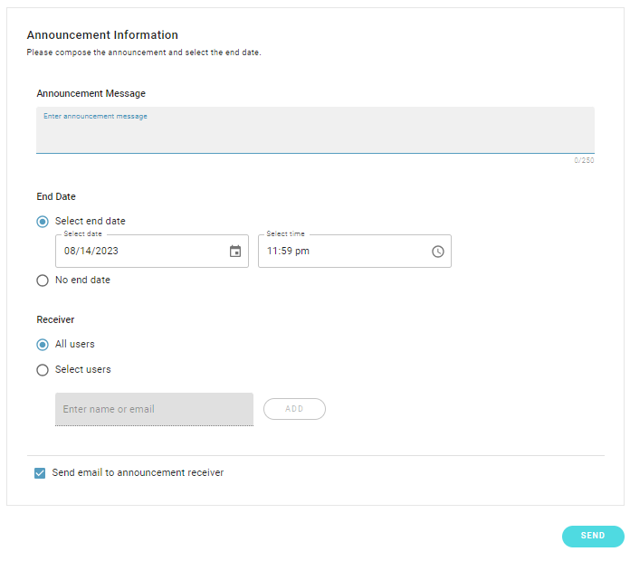

# 5. Announcement

The administrator can send system/email announncements to all/select users of the Deeploy system, start by clicking the "NEW ANNOUNCEMENT" button.

Clicking on "**NEW ANNOUNCEMENT**" brings up the announcement information setting.

**Announcement Message:** The administrator can edit the content here, the max. number of characters is 250.

**Date:** Each announcement can be given an end date, the announcement will automatically be taken down once the end date is reached. if no end date is selected, users can still disable the announcement banner themselves.

**Receiver:** notifications can be sent to all users or select users. The administrator can type in any account name and add him/her as the receiver of this announcement.

**send announcements via email:** Other than sending out system announcements (which can be seen only if the user logs into the platform), the same announcement can also be sent to the user's account email if the system is linked to any mail server.
