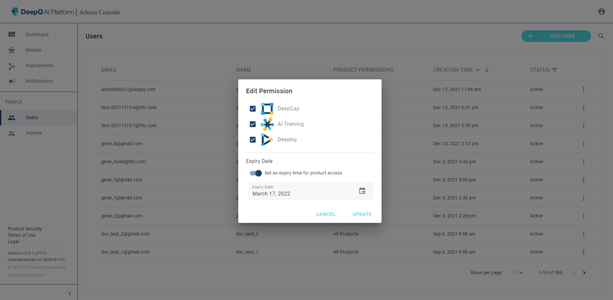

# 6. Account Management

.png>)

The administrator can perform the floowing tasks related to user accounts:

* create new account
* edit account permission--module authorization & expiry date
* modify password
* suspend/delete account

.png>)

.png>)

.png>)

