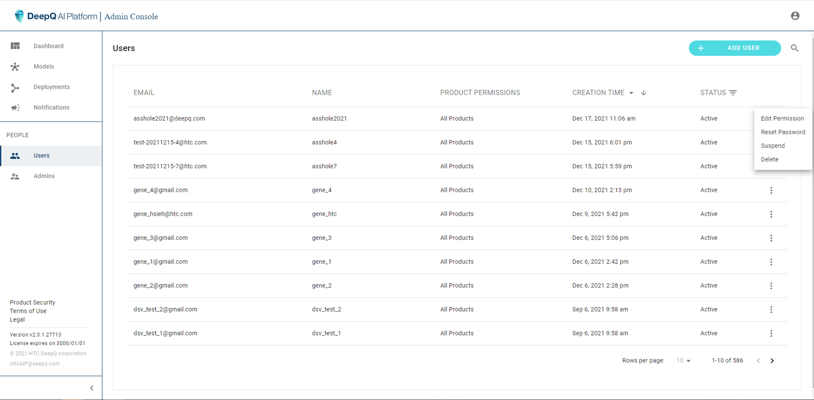
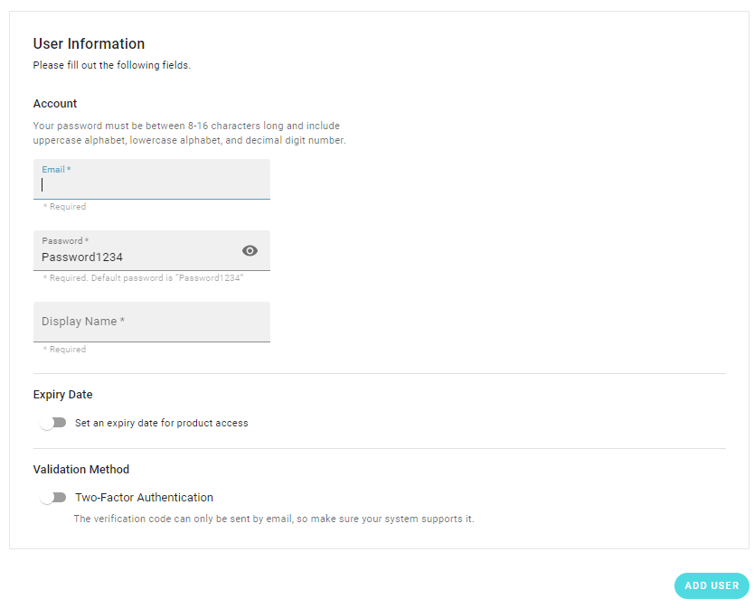
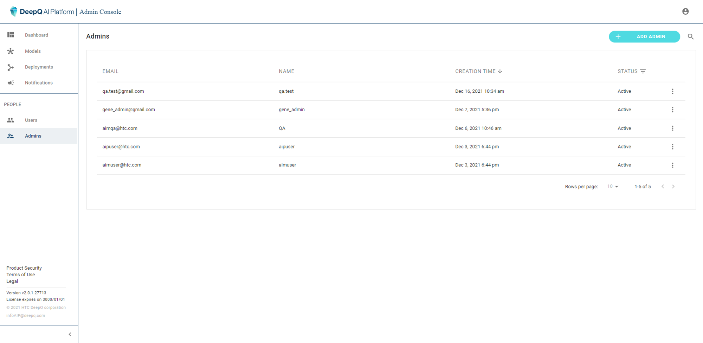
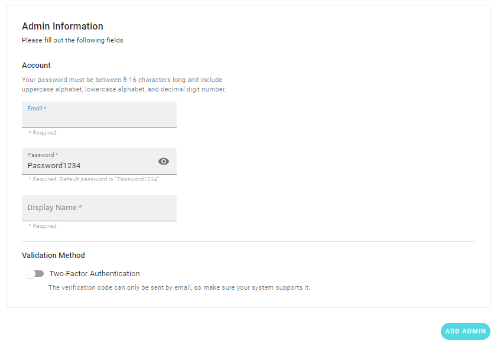

# 6. Account Management

### Users

The administrator can perform the following tasks related to user accounts:

* create new account
* edit account permission--module authorization & expiry date
* reset password
* suspend/delete account

#### Add User

Adding a new user requires the admin to set the following information：

* Account login email
* Password (later can be changed by the user)
* Personal information
* Product permission (of the three main modules)
* Account expiry date

### Admins

There can also be multiple administrators of the platform. Clicking on the "Admins" on the sidebar shows the list of administrators.

Adding a new administrator requires the admin to set the following information：

* Account login email
* Password (later can be changed by the user)
* Personal information

