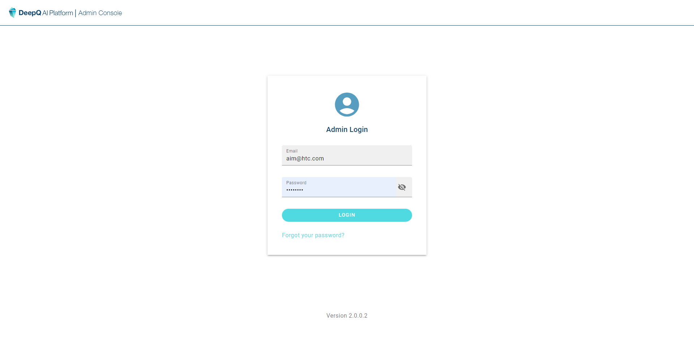

# 1. Deeploy Admin Backstage Overview

The Deeploy backstage is where the administrator can perform the following tasks:

1. view & manage resources (inferenceCPU &  GPU)
2. import and manage models that have been trained in AI Training module
3. create model deployments: select model, query rules, worklist items, AI indicators & authorization list
4. Send out system/email notifications for all/selected accounts
5. create/manage/suspend/delete user accounts

<figure><figcaption>
Deeploy admin backstage login page
</figcaption></figure>
