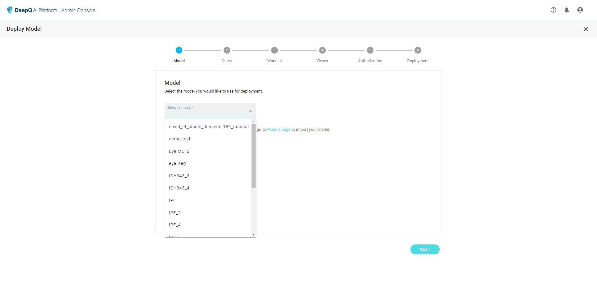

# 1. Select Model

* Select the model you want to deploy from the model list
* If the model cannot be found, make sure that it is properly imported. follow the instructions in [3. Models](../../3.-models.md)

*
