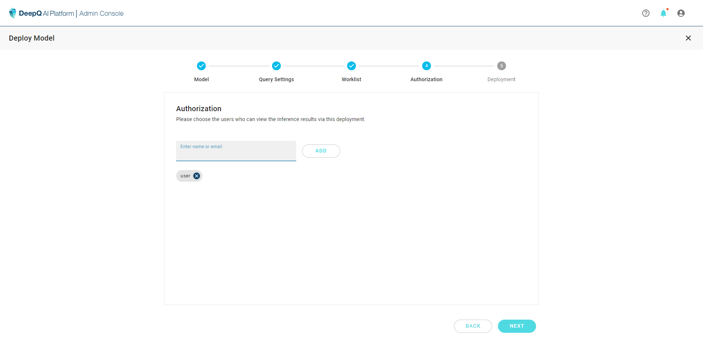

# 4. Authorization

* Enter the user accounts to grant deployment authorization.
* Authorized deployments will show up in the users "Deeploy-->Authorized models"
* The authorized user should have a valid Deeploy system account first.  [6. Account Management](../../account-management.md)

*
