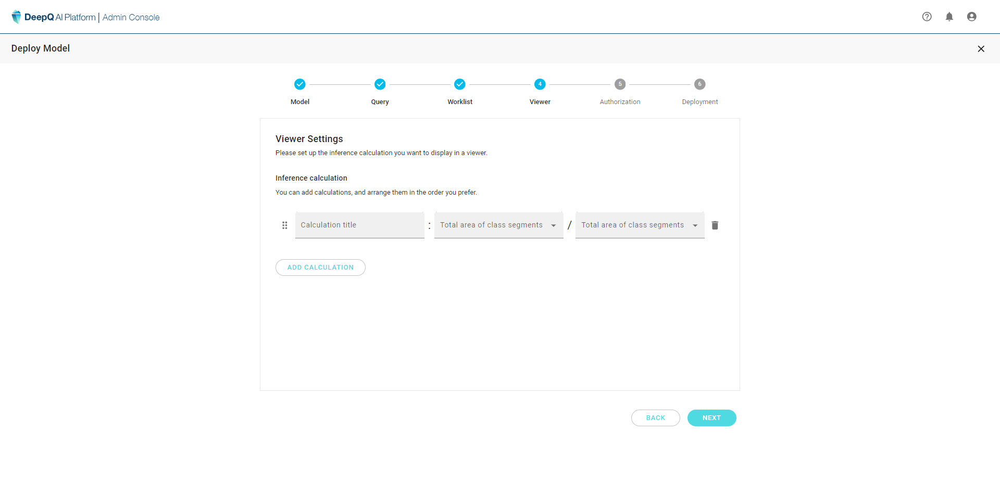

# 4. Set AI viewer

### AI viewer - Inference Calculation

Other than direct inference results provided by each model, DeepQ AI viewer can also provide the following calculated results of the inference output:

**Object detection: Width ratio between 2 classes (max. bounding box width for each class)**

**Object segmentation: Total area ratio between two classes**

To show calculation results in the AI viewer, users will need to setup the calculation during deployment creation.

<figure><figcaption>
inference calculation is only available with object detection &#x26; segmentation models
</figcaption></figure>

<figure><figcaption>
All possible worklist items can be chosen from the drop down menu, you can also rearrange the order by click and drag.
</figcaption></figure>
