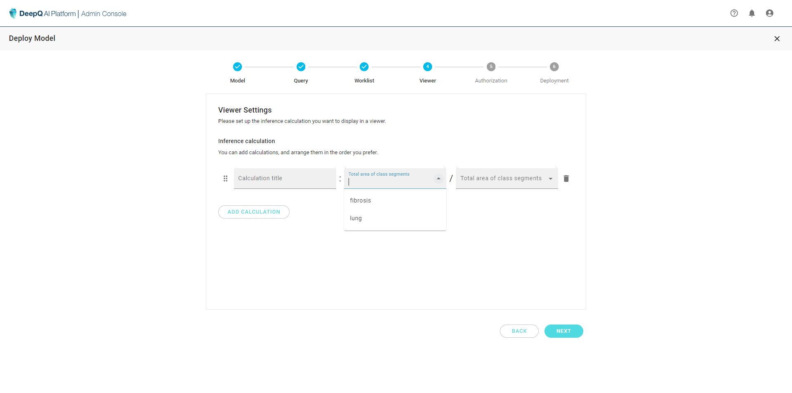

# 4. Set AI viewer

### AI viewer - Inference Calculation

Since each deployment job serves a different purpose, the displayed items are set up independently for each deployment.

<figure><figcaption>
4 preset DICOM tags are provided as a start, users can also modify the items they wish to see on the worklist.
</figcaption></figure>

<figure><figcaption>
All possible worklist items can be chosen from the drop down menu, you can also rearrange the order by click and drag.
</figcaption></figure>
