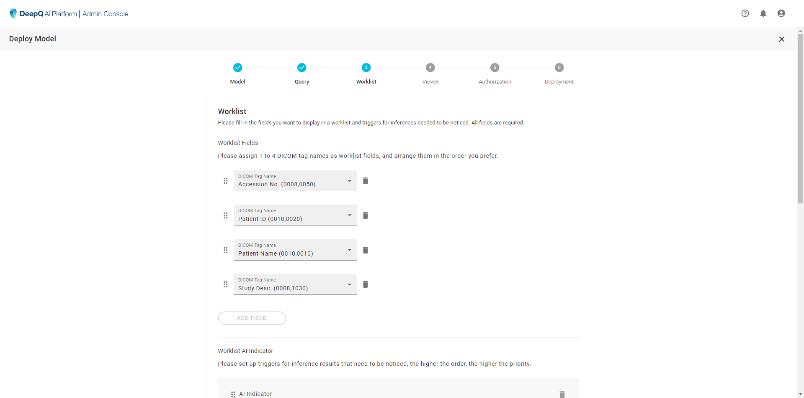
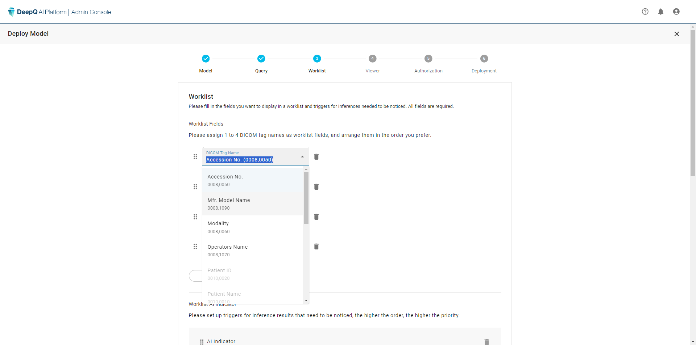
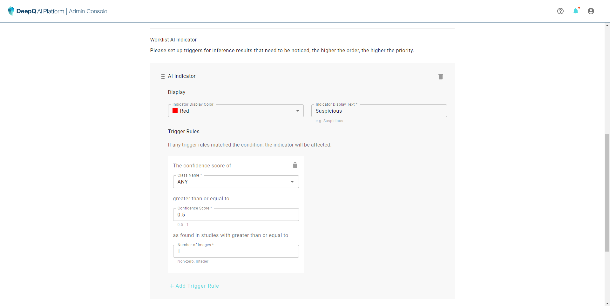
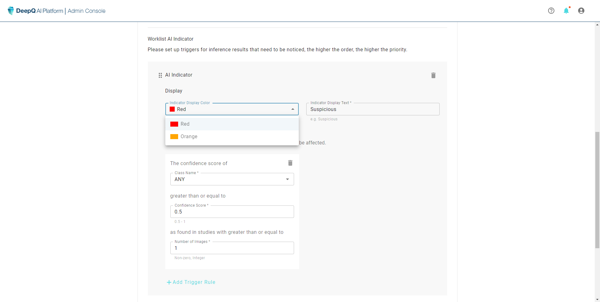
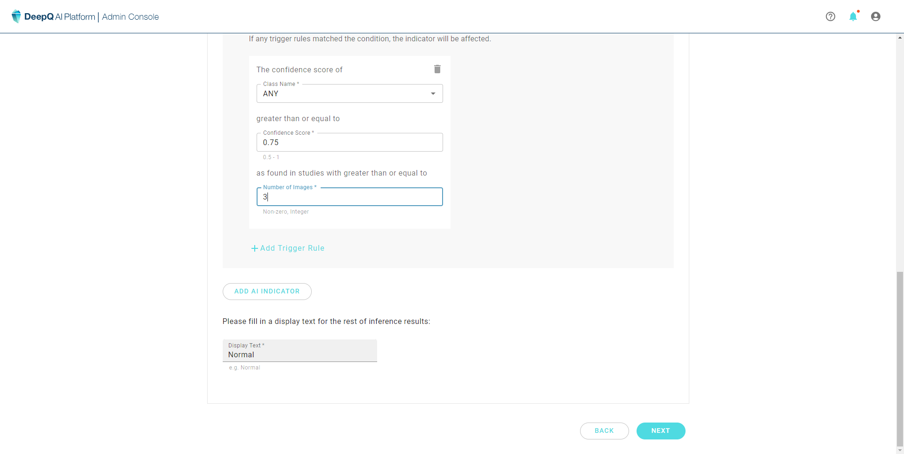

# 3. Set Worklist items & AI Indicator(s)

### Worklist items

Since each deployment job serves a different purpose, there should also be separate worklist & layouts. You can setup items in the worklist for your own needs.

<figure><figcaption>
4 preset DICOM tags are provided as a start, users can also modify the items they wish to see on the worklist.
</figcaption></figure>

<figure><figcaption>
All possible worklist items can be chosen from the drop down menu, you can also rearrange the order by click and drag.
</figcaption></figure>

<figure><figcaption></figcaption></figure>

### AI Indicator(s)

<figure><figcaption></figcaption></figure>

<figure><figcaption></figcaption></figure>
