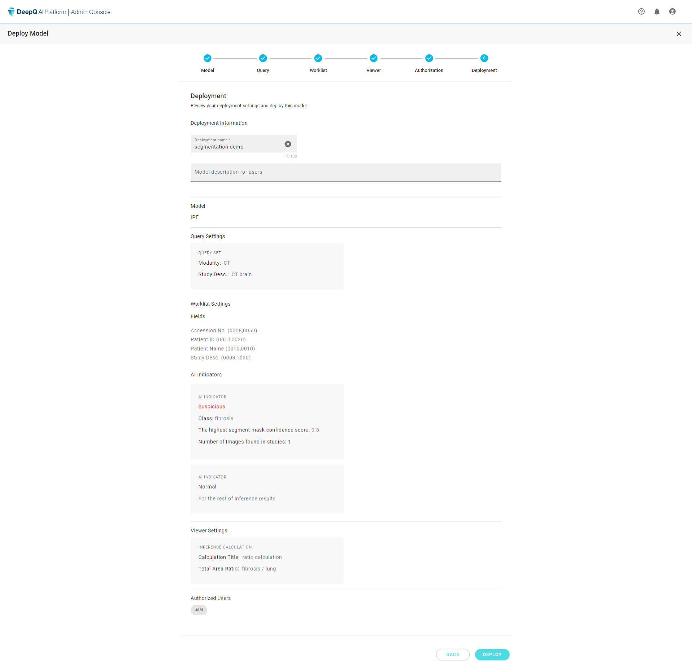

# 6. Deployment

Finally, name the deployment and add any description necessary. If all the settings are correct, click on "**DEPLOY**" to complete the deployment and it will occupy one unit of inference resource and show up in the dashboard as "Running"

\*\* When creating a new deployment, the inference resource selection order is available GPU then available CPU.

