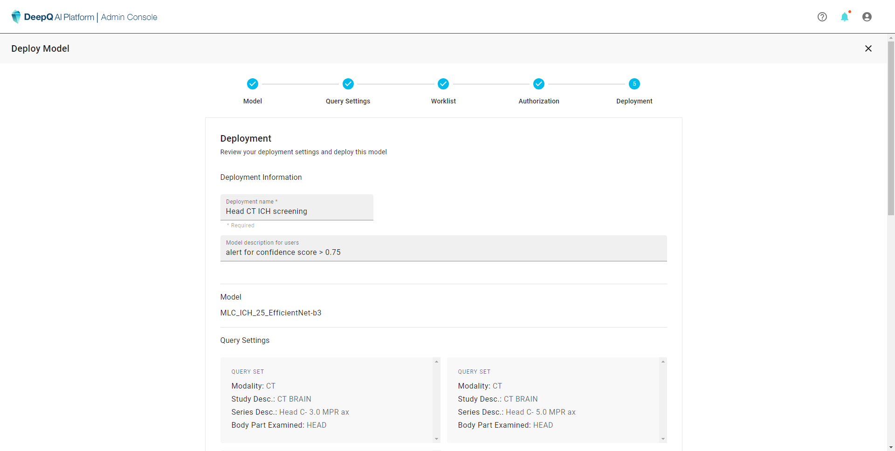

# 5. Deployment

Finally, the administrator should name this deployment and add any description neccesary. If all the settings are correct, click on "**DEPLOY**" to complete the deployment and it will occupy one unit of inferernce resource and show up in the dashboard as "Running"

