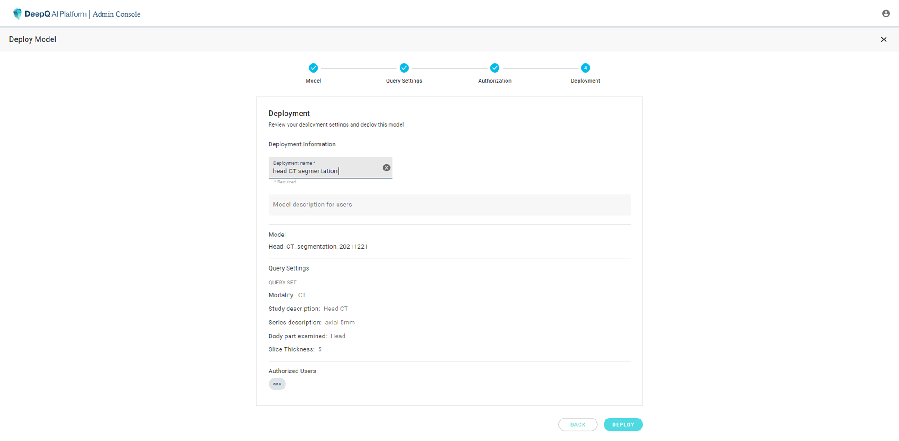

# 4. Deployment

Finally, the administrator should create a name for the deployment and add any description neccesary for the authorized user. If all the settings are correct, click on "**DEPLOY**" to complete the deployment and it will show up in the dashboard as "Running"

