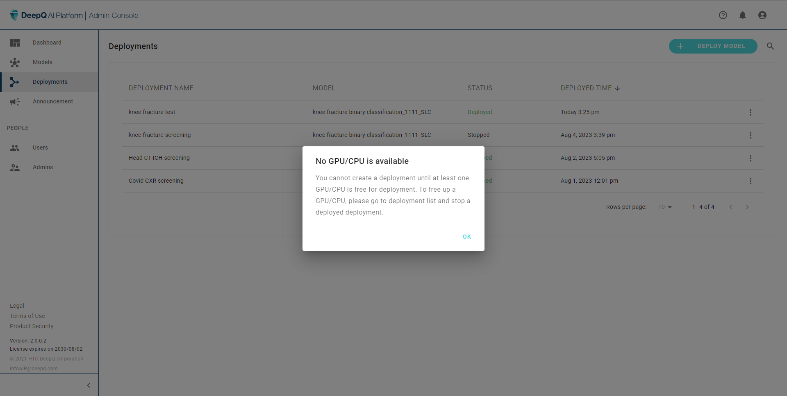

# 4.1 Create deployment

To create a deployment, the administrator will go through a 5-step process:

1. Select model to be deployed
2. Set query settings
3. Set Worklist items & AI Indicators
4. Set authorization
5. Confirm & deploy

\*\*The maximum number of deployments is limited by the number of inference hardware (number of GPUs + 1 CPU). if all inference resources are in use, selecting "**DEPLOY MODEL**" will pop out a warning window, informing the administrator to stop a running deployment in order to release a inference resource.

