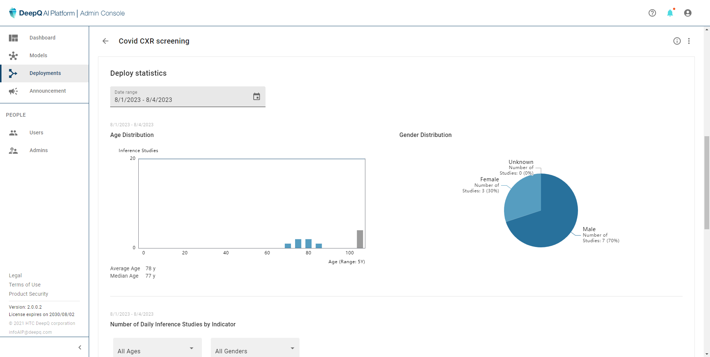
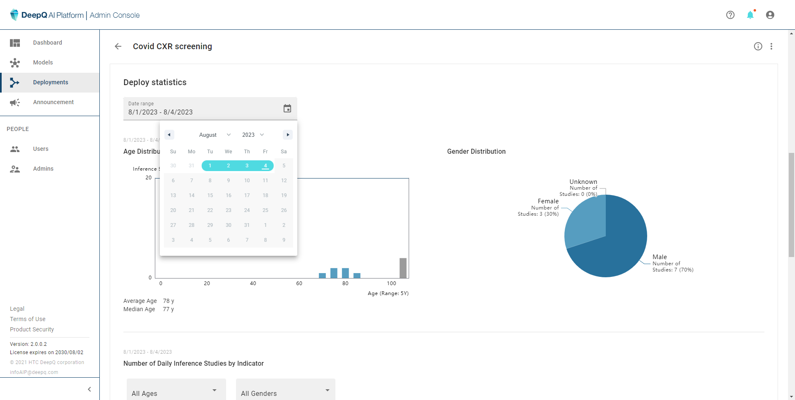
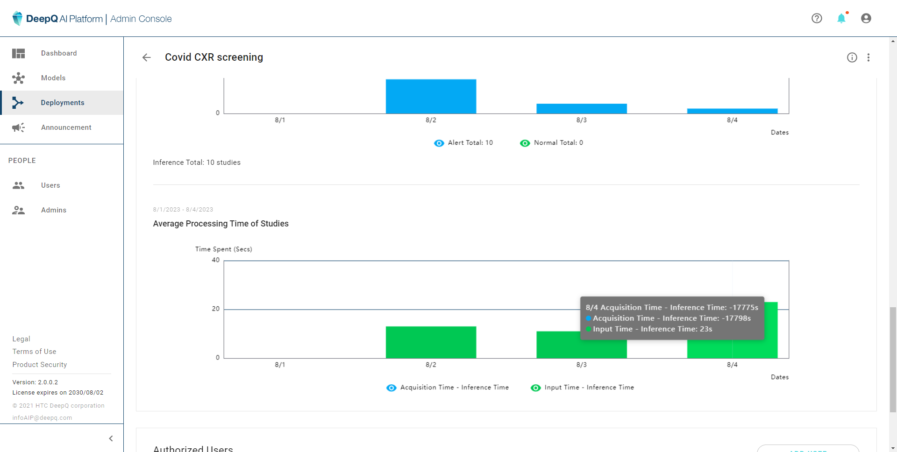

# 4.2.1 Deployment Statistics

Under the inference list is the deployment statistics section, where users can view the statistical information within a specific time range. There are three main statistical information that can produced within the given time range (the default time range is past 3 months)：

**Population statisics**：gender distribution, age distribution, average age & median age. If age/sex information is missing from any DICOM study it will be counted as unknown

<figure><figcaption>
population statistics
</figcaption></figure>

<figure><figcaption>
setting a time range for deployment statistics
</figcaption></figure>

**Inference statistics**：The bar graph of processed studies each day, and the number of triggered AI indicators (if any). Users can further look into the information by assgining a specific age range or gender.

<figure><figcaption></figcaption></figure>

<figure><figcaption></figcaption></figure>
