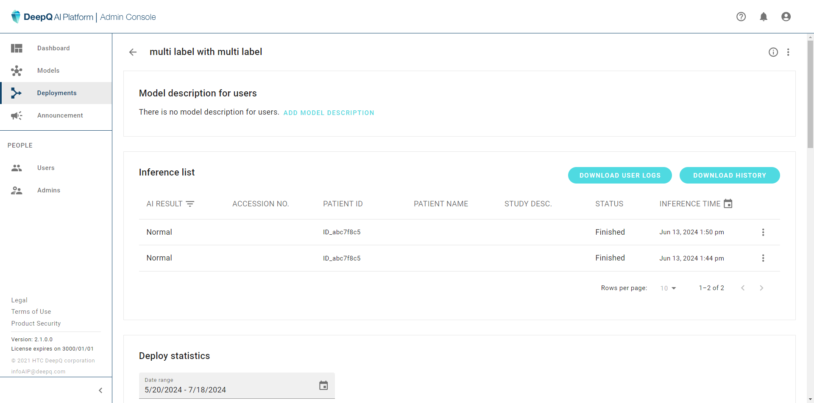
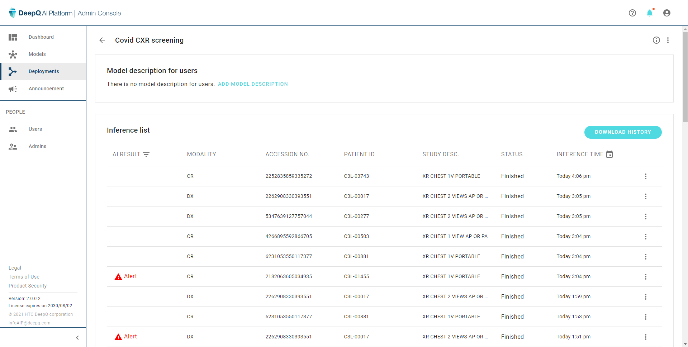
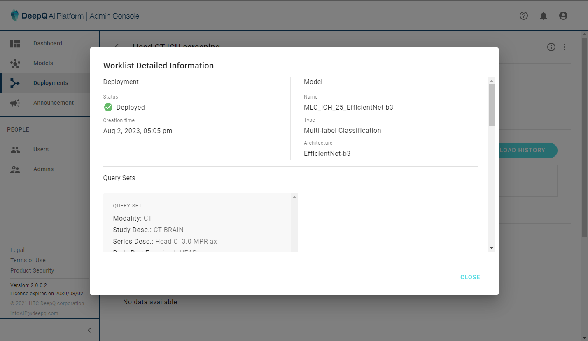

# 4.2 View/Manage Deployments

### Deployment Overview

After setup, the name and description of each deployment can be modifed at the deployment list, click on the  to edit deployment detail and stop/delete deployments.

<figure><figcaption></figcaption></figure>

### Deployment Details

Selecting a deployment&#x20;

<figure><figcaption></figcaption></figure>

<figure><figcaption></figcaption></figure>
