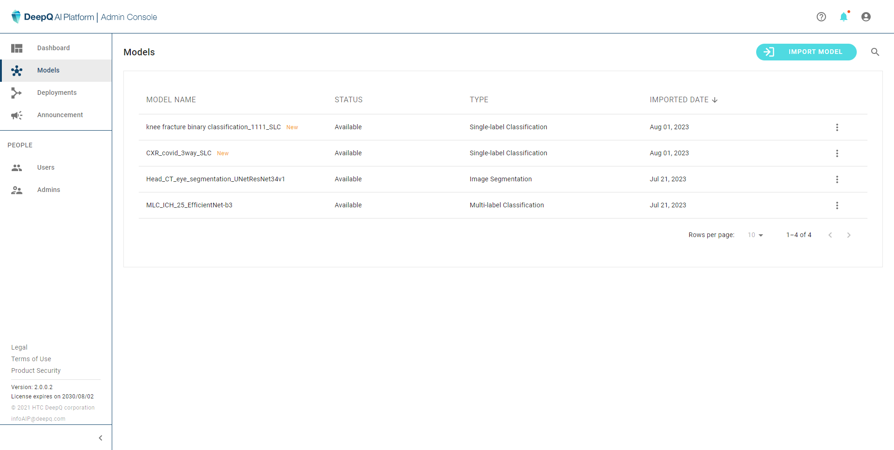

# 4. Deployment

Each running model service is defined as a "Deployment" in Deeploy. There can be multiple deployments running simultaneously depending on the number of models and inference resource (GPUs & CPU).

### Deployment list

To create a new deployment just click on the "DEPLOY MODEL" button, or select "Deploy" from the model list in [3. Models](../3.-models.md)
