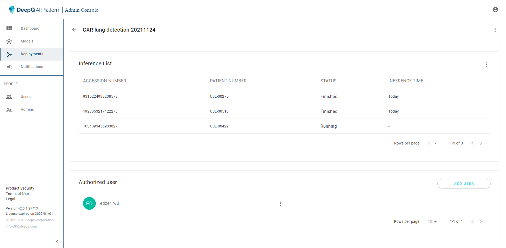

# 4. Deployment

Each running model service is defined as a "Deployment" in DeepQ AI Platform. There can be multiple deployments running simultaneously depending on the number of models and inference GPU resource.

### Deployment overview

### Deployment detail

A deployment job consists of the essential settings that is shown in the deployment detail page

* Model：the model that is running in this deployment
* Query set(s)：Rules of the images delivered and processed by this deployment
* Authorization：Users that have access to view the results of this deployment

The status of each inference job on the list is shown as either "Waiting", "Running" or "Finished"

The admin can download the complete inference history of this deployment by clicking "" at the upper right of the inference list.

