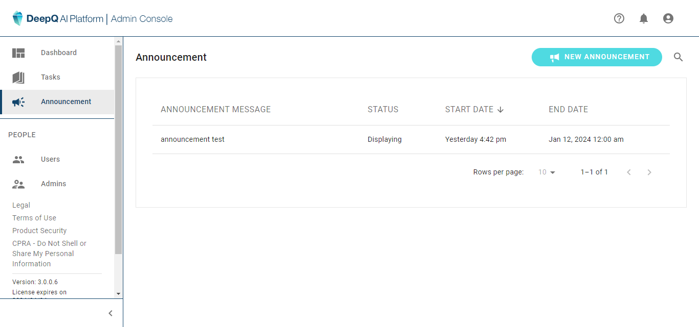
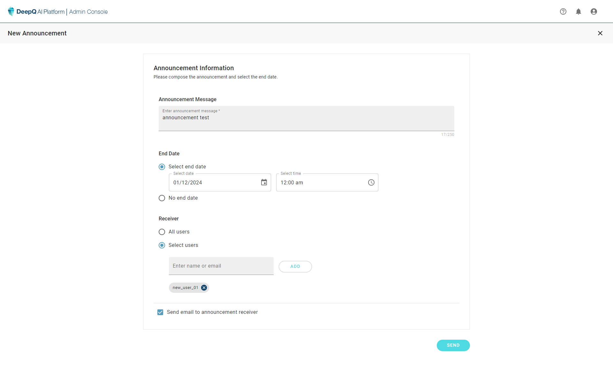
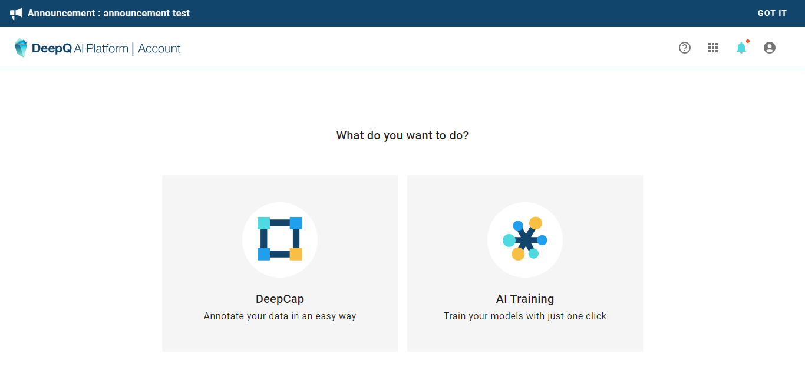

# 📣 Create Announcements

### Announcements

<figure><figcaption></figcaption></figure>

#### Create New Announcement

* **Notification Message:** The administrator can edit the content here, the max. number of characters is 250.
* **Date:** Each system notification can be given an end date, the notification will automatically be taken down once the end date is reached. if no end date is selected, users can still disable the notification banner themselves.
* **Receiver:** notifications can be sent to all users or select users. The administrator can type in any account name and add him/her as the receiver of this notification.
* **email:** Other than sending out system notifications (which can be seen only if the user logs into the platform), the same notification can also be sent to the user's account email.

<figure><figcaption></figcaption></figure>

Once you announcement is sent via the platform, receiving users will notice a banner on top of the product once they login. Users may dismiss the notification by clicking on "GOT IT", or else it will disappear once the end date/time is reached.

<figure><figcaption>
notification banner shown to users
</figcaption></figure>

