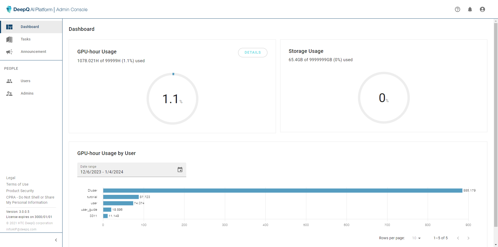
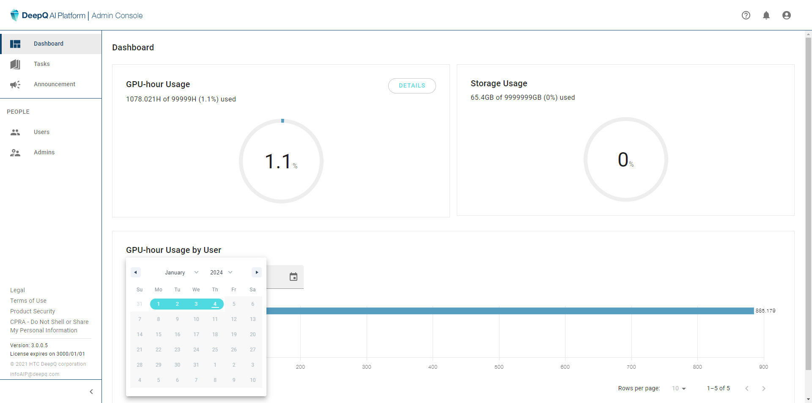
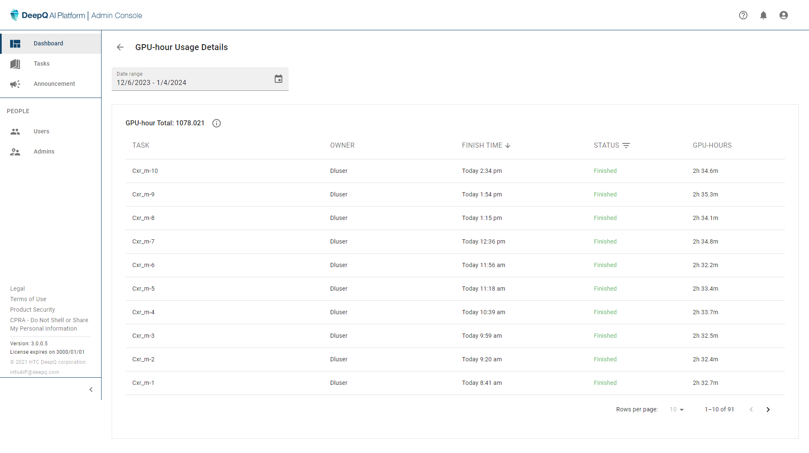

# 🔢 Resource Check

The first thing showing when you log into DeepQ AI Platform Admin Console is the dashboard. this is where the administrator can view the total training GPU-hour usage, total storage usage and GPU-hour usage of each user.

<figure><figcaption></figcaption></figure>

<figure><figcaption></figcaption></figure>

<figure><figcaption></figcaption></figure>


To purchase more resources (GPU-hrs, storage space or user accounts), please contact DeepQ Sales Personnel or via feedback form.


