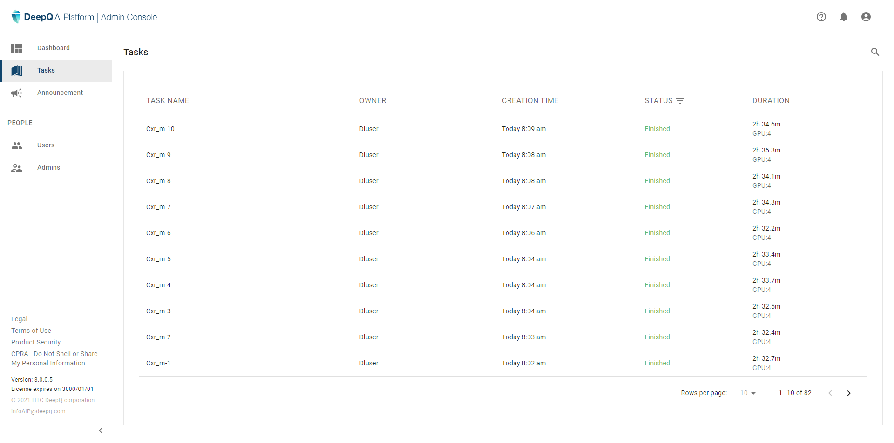

# ⚙ View & Manage Tasks

### View Tasks

Training tasks created by users are listed here, you may also sort them by the following status: &#x20;

* **In progress**: the training task is running by the moment (will show progress)
* **Waiting**: the training task is waiting to start (will show waiting order)
* **Finished**: the training task is completed
* **Stopped**: the training task has been stopped (either by the owner or admin)
* **Error**: something wrong happened to the training task

<figure><figcaption></figcaption></figure>


Please contact DeepQ if your task is waiting too long / shows error


### Manage Tasks

&#x20;there are two operations the administrator can do here:&#x20;

* **Stop task**: Stop a running task. Once the task is fully stopped, the 1st task that is waiting in line (if there is any) will proceed to start. Be aware that stopped tasks cannot be resumed.
* **Set as 1st in line:** Move the waiting order of any given task to the 1st in line.


Please make sure that owner of the tasks were fully aware of the changes you plan to make (stop task & change waiting order).


