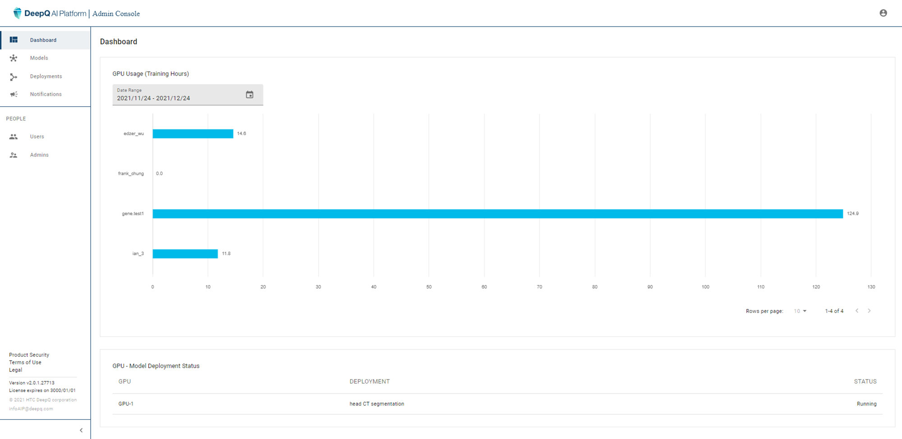
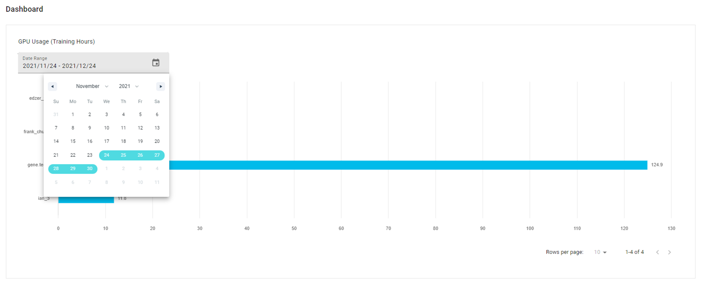
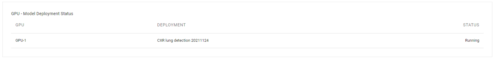

# 2. Dashboard

The first thing showing when you log into DeepQ AI Platform backstage is the dashboard. this is where the administrator can view the training GPU usage of each user and the inference GPU.

| At the bottom of the dashboard shows the status of inference GPU and deployments |
| :------------------------------------------------------------------------------: |
