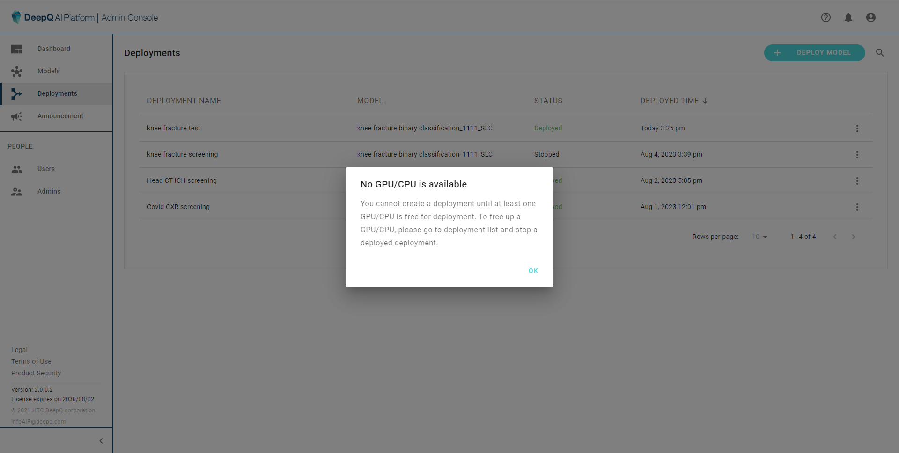

# 2. Dashboard

The first thing showing up in the Deeploy backstage is the dashboard. this is where the administrator can view the list of inference resources, including GPUs & CPU.

The total numbers of inference resource is the max number of deployments that can run simultaneous on the system. the number of GPUs reflect how many discrete GPU cards are installed onto the system while each system will have an additional CPU resource for deployment.

<figure><figcaption></figcaption></figure>
