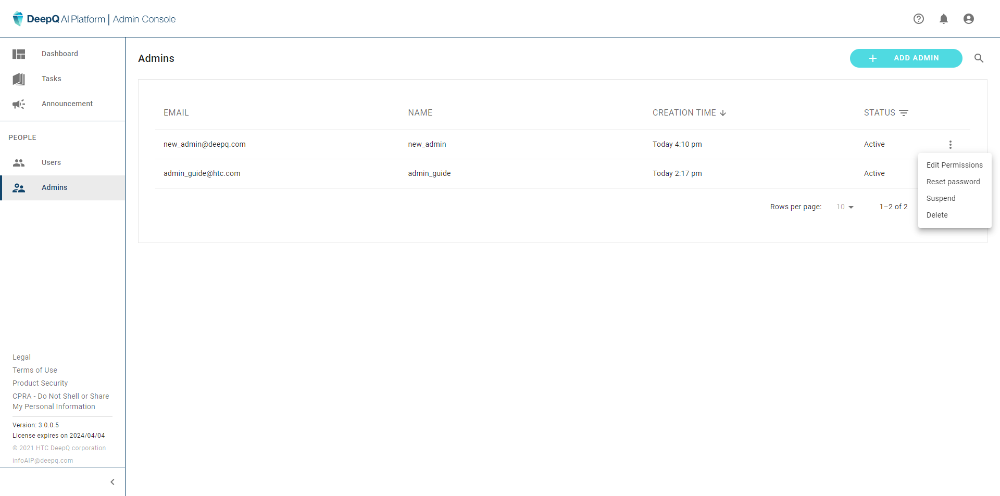

# Admin Accounts

### Administrator List

There can also be multiple administrators of the platform. Clicking on the "Admins" on the sidebar shows the list of administrators.

### Add New Admin

Adding a new administrator requires the admin to set the following information：

* Account login email
* Password (can be changed later)
* Display Name
* Two-Factor Authentication on/off

### Manage Admin account

* Edit Permission (Two-Factor Authentication on/off)
* Reset Password
* Suspend account (can be unsuspended)
* Delete account

<figure><figcaption></figcaption></figure>

