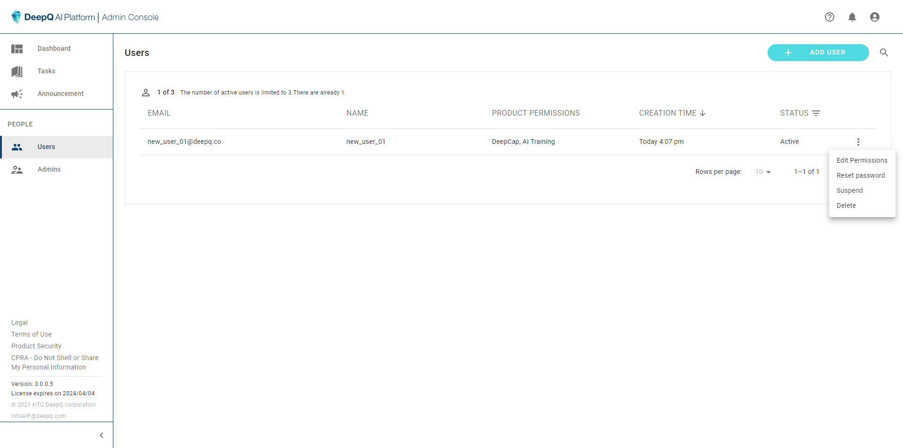
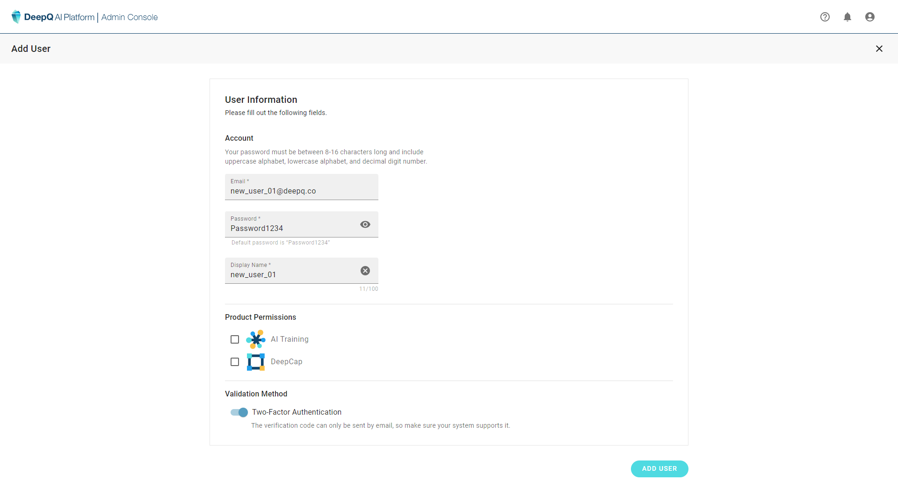

# User Accounts

### Users

The administrator can perform the following tasks related to user accounts:

* create new account
* edit account permission--module authorization & expiry date
* reset password
* suspend/delete account

#### Manage User Account

The administrator can perform the following tasks related to user accounts:

* create new account
* edit account permission--module authorization & expiry date
* reset password
* suspend/delete account

<figure><figcaption></figcaption></figure>

####

#### Add New User

Adding a new user requires the admin to set the following information：

* Account login email
* Password (later can be changed by the user)
* Display Name
* Product permission
* Two-Factor Authentication

<figure><figcaption></figcaption></figure>
